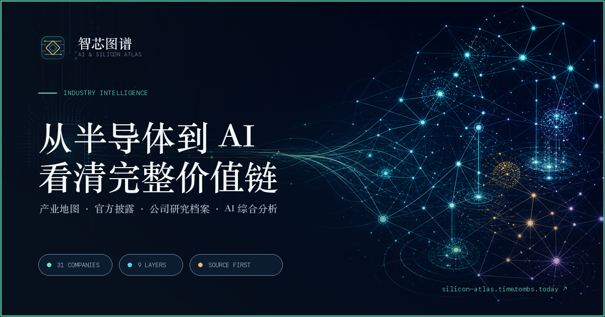

# 智芯图谱 · AI & Silicon Atlas

一个沿价值链组织的中文 AI 与半导体产业情报站。把芯片设计、设备材料、晶圆制造、存储、封装测试、算力基础设施、模型平台和 AI 应用放在同一张图里理解。

**在线访问：[silicon-atlas.timetombs.today](https://silicon-atlas.timetombs.today)**

## 你可以在这里做什么

- **看产业关系**：通过交互式地图理解九个核心环节的上下游连接、价值流与需求反馈。
- **研究关键公司**：浏览 31 家全球代表公司的商业模式、核心能力、竞争参照、上下游依赖与待验证问题。
- **比较与关注公司**：在浏览器本地保存关注列表，并把最多 4 家公司放进同一视图横向比较，不上传个人选择。
- **查看每日变化**：变化雷达只展示最近一轮新增披露、指标、AI 综合分析与权威情报，也可切换到自己的关注范围。
- **跟踪官方披露**：查看 SEC EDGAR、OpenDART 及公司投资者关系入口，保留来源和报告期。
- **阅读 AI 综合分析**：基于已抓取的结构化证据整理变化、经营信号、价值链影响与不确定性。
- **浏览权威情报**：聚合国际机构、央行研究与公司一手文章，提供原文链接、产业链关联和有证据边界的中文 AI 摘要。
- **导出给其他 AI**：通过 [`llms.txt`](https://silicon-atlas.timetombs.today/llms.txt)、[完整 JSON](https://silicon-atlas.timetombs.today/exports/atlas.json)、[每日变化 JSON](https://silicon-atlas.timetombs.today/exports/delta.json) 或 [Markdown 上下文](https://silicon-atlas.timetombs.today/exports/atlas.md) 接入 Agent 与知识库。

## 推荐的浏览方式

1. 从[产业地图](https://silicon-atlas.timetombs.today/map/)选择感兴趣的环节。
2. 进入公司研究卡，先理解商业模式和产业位置，再查看历史指标与近期披露。
3. 在[公司目录](https://silicon-atlas.timetombs.today/companies/)加入关注，并用[公司比较](https://silicon-atlas.timetombs.today/compare/)建立自己的观察组。
4. 打开[变化雷达](https://silicon-atlas.timetombs.today/radar/)查看最近一次更新，再到[权威情报](https://silicon-atlas.timetombs.today/news/)沿来源链接阅读原文。
5. 把 AI 分析当作研究线索，沿证据链接回到官方原文独立核验。

## 我们如何处理信息

智芯图谱优先使用官方披露和第一方资料。事实数据、AI 推断、风险边界与需要继续验证的问题会分开呈现。

AI 不生成评级、目标价或买卖建议。当证据包只有披露元数据、没有公告正文时，分析会明确标记“无法判断”，而不会把缺少信息解释成没有事件。

公司数据、机构文章和 AI 摘要由 GitHub Actions 每天自动更新；由于 SEC 会限制共享云出口，公开 SEC JSON 通过只读中继传输，并在数据健康页明确展示来源状态。部分尚未接入自动化数据源的市场会显示为人工维护或待配置状态。

## 重要说明

本站用于产业信息整理、学习和研究导航，不构成证券研究报告或投资建议。市场有风险，所有结论都应回到原始资料独立核验。

---

想在本地运行、扩展数据源或了解部署方式，请阅读[开发与维护指南](docs/development.md)。数据结构、失败回退和 AI 证据规范见[数据管线说明](docs/data-pipeline.md)。
